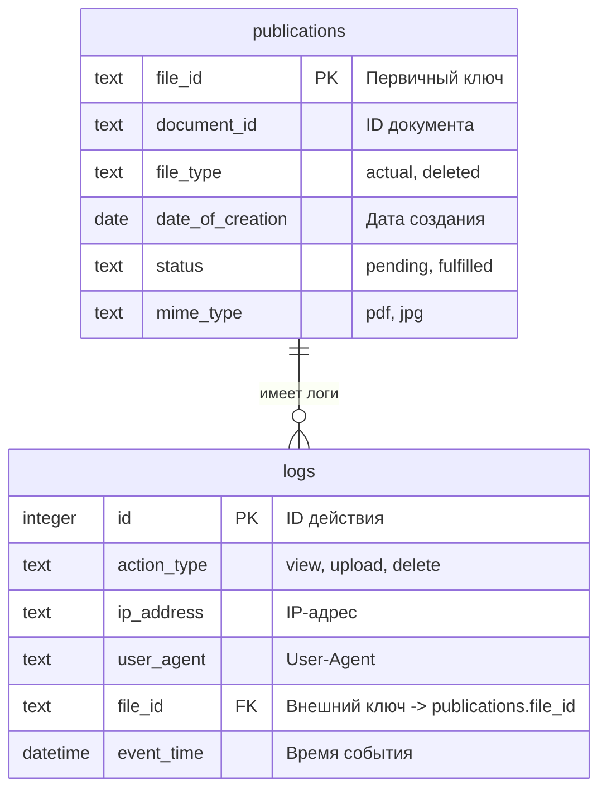

# Originality checker v1.0.0 
## Описание:
### Тестовый деплой сервиса:
https://originality-checker.onrender.com 

В папке publications сейчас для тестов находится один единственный файл: `test-123`

### Временный authorization token:
`e704be9a691601ee99a6a483f07f3655c0cbed54e9588ce17abd5ec11fa0c5bf`

---

## API документация:
### Ограничения
- Для загрузки PDF доступны два endpoint'а:
    - `POST /api/upload` — **multipart/form-data** (legacy)
    - `POST /api/upload-json` — **application/json** (base64) (**рекомендуется для 1С**)
- Максимальный размер PDF: **50MB** (проверяется по декодированным байтам)
- Для `/api/upload-json` размер JSON-тела должен быть меньше лимита парсера (сейчас настроен запас, см. `src/index.js`)

---

### Доступные запросы:

1. `POST /api/upload-json` (рекомендуется для 1С)
#### Заголовки:
- `Authorization: Bearer <STATIC_TOKEN>`
- `Content-Type: application/json`

#### Тело запроса (JSON)
| Поле          | Тип данных | Required | Описание |
|--------------|------------|----------|----------|
| `file`       | string     | true     | PDF в base64. Допускается также формат `data:application/pdf;base64,<...>` |
| `document_id`| string     | true     | Идентификатор документа |
| `file_id`    | string     | true     | Идентификатор файла (используется как имя файла на диске и как часть URL) |
| `mime_type`  | string     | false    | По умолчанию `pdf` |

#### Запрос имеет 3 сценария:
- **Первая публикация файла на веб-ресурсе с полученными document_id и
  file_id.**\
  Веб-ресурс помечает полученный файл статусом pending (QR-кода ещё нет).
- **Перезапись файла со статусом pending на файл с QR-кодом.**\
  Веб-ресурс помечает полученный файл статусом fulfilled (файл содержит QR-код).
- **Запись нового актуального файла вместо файла с таким же documnet_id
  (file_id при этом разные)**\
  Веб-ресурс помечает в БД старый файл как "deleted", а новый, как "actual" и "pending".
  При этом старый файл удаляется, но запись о нём остаётся в БД

#### Пример успешного цикла:
- 1С отправляет PDF → получает ссылку → генерирует QR по ссылке.
- 1С отправляет файл (тот же file_id) с QR → веб-сервис заменяет его и ставит fulfilled.
- Позже при новом издании (тот же document_id, другой file_id) веб-сервис помечает старый как deleted и сохраняет новый.

#### Пример запроса
```json
{
  "file": "<BASE64_PDF>",
  "document_id": "doc01",
  "file_id": "id001",
  "mime_type": "pdf"
}
```

#### Ответ (пример)
```json
{
  "message": "file saved (pending QR)",
  "file_id": "id001",
  "link": "https://originality-checker.onrender.com/publications/id001"
}
```

---
2. `post /api/upload`
   #### Заголовки:
   `Authorization: Bearer <STATIC_TOKEN>`
   #### Тело запроса:

   | Поле           |  Тип данных  |  Required  |
   |:---------------|:------------:|:----------:|
   | `file`         | binary (PDF) |    true    |
   | `document_id`  |    string    |    true    |
   | `file_id`      |    string    |    true    |

    #### Сценарии аналогичны `post /api/upload-json`

---

3. `get /publications/:file_id`
   #### Заголовки:
   Отсутствуют (доступ открыт по прямой ссылке)
   #### Параметры запроса (передаются в url):

   | Поле           |  Тип данных  |  Required  |
   |:---------------|:------------:|:----------:|
   | `file_id`      |    string    |    true    |

   #### Запрос имеет 3 сценария:
   - **HTTP 200 OK**\
   Если в таблице publications существует запись с данным file_id и file_type
   == 'actual', то возвращается сам PDF-файл с заголовком Content-Type:
   application/pdf
   - **HTTP 410 Gone**\
   Если запись существует, но file_type == 'deleted', то возвращается
   текст: "*The printed form is not relevant*"
   - **HTTP 404 Not Found**\
   Если записи с таким file_id нет вовсе → возвращается текст:
   "*Printable form not found*"
---

4. `get /api/status/:file_id`
   #### Назначение:
   Получение статуса и метаданных публикации по file_id.
   Используется для отладки и проверки корректности записей в БД.
   #### Заголовки:
   `Authorization: Bearer <STATIC_TOKEN>`
   #### Параметры запроса:

   | Поле           |  Тип данных  |  Required  |
   |:---------------|:------------:|:----------:|
   | `file_id`      |    string    |    true    |

   #### Запрос имеет 2 сценария
   - Если запись с указанным file_id существует, то возвращаются все поля
   из таблицы publications.
   - Если записи нет, то возвращается **HTTP 404 Not Found**,
   { "error": "not found" }.
---

5. `get /api/logs`
   #### Назначение:
   Возвращает список последних действий из таблицы logs.
   Используется для отладки или административного просмотра активности.
   #### Заголовки:
   `Authorization: Bearer <STATIC_TOKEN>`
   #### Параметры запроса:
   Отсутствуют
   #### Запрос имеет 1 сценарий
    - Возвращает массив до 500 последних записей, отсортированных по дате
    (ts DESC).
---

## Архитектура:
- Установка соединения 1С с веб-ресурсом происходит по статическому `Bearer` токену,
  сгенерированному через `crypto`
- Веб-ресурс написан на фреймворке - `Express.js` (`node.js`) и реализуется по `REST API` архитектуре
- Простое логирование через библиотеку `Morgan` с фильтрацией заголовка `authorization`, чтобы
  токен не попадал в логи. В логах отображается кто когда какой запрос сделал, посредством
  использования встроенного формата `morgan('combined')`. Вывод логов в консоль при локальной разработке.
- Прием файлов поддерживает **два формата**:
    - `multipart/form-data` через `multer` (legacy)
    - `application/json` (файл в base64) для совместимости с 1С


- БД `sqlite3`, хранящиеся в файле - `database.sqlite`:
