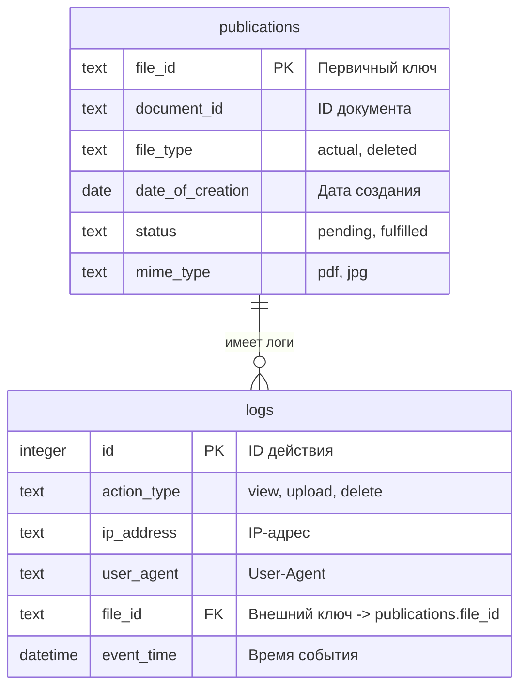

# Originality checker v1.0.0

## Описание:
### Тестовый деплой сервиса:
https://originality-checker.onrender.com

В папке `src/publications` для тестов находится один файл:
- `file_id`: `test-125`
- `document_id`: `doc-001`

### Временный authorization token:
`e704be9a691601ee99a6a483f07f3655c0cbed54e9588ce17abd5ec11fa0c5bf`

> ⚠️ ВАЖНО: ручное удаление файлов из `src/publications` **не рекомендуется**.
> Корректный способ снять файл с публикации — `PATCH /api/publications/:file_id/delete`.
---

## Стек
- **Express.js**
- **SQLite** (`sqlite3`) — хранение метаданных и логов в `database.sqlite`

---

## Быстрый старт (локально)

### Требования
- Node.js / npm
- `.env`

### 1. Установка зависимостей
```bash
npm install
```

### 2. Инициализация окружения (.env)
```bash
npm run setup:env
```
Создаст `.env` на основе `.env.example`.

**STATIC_TOKEN** — статический токен для авторизации запросов к `/api/*`.

### 3. Запуск сервиса:
```bash
npm run start
```

После запуска сервис будет доступен по адресу:
- http://localhost:3000

---


## API документация:
### Ограничения
- Для загрузки PDF доступны два endpoint'а:
    - `POST /api/upload` — **multipart/form-data** (legacy)
    - `POST /api/upload-json` — **application/json** (base64) (**рекомендуется для 1С**)
- Максимальный размер PDF: **50MB** (проверяется по декодированным байтам)
- Для `/api/upload-json` размер JSON-тела должен быть меньше лимита парсера (сейчас настроен запас, см. `src/index.js`)

---

### Доступные запросы:

1. `POST /api/upload`
    Загрузка PDF в формате JSON (base64). Используется для интеграции с 1С.
    
    **Заголовки:**
   - `Authorization: Bearer <STATIC_TOKEN>`
   - `Content-Type: application/json`
    
    **Тело запроса (JSON):**

    | Поле           | Тип данных | Required | Описание |
    |----------------|------------|----------|----------|
    | `file`         | string     | true     | PDF в base64|
    | `document_id`  | string     | true     | Идентификатор документа |
    | `file_id`      | string     | true     | Идентификатор файла (используется как имя файла на диске и как часть URL) |
    | `mime_type`    | string     | false    | По умолчанию `pdf` |

    **Запрос имеет 3 сценария:**
    - **Первая публикация** (новые `document_id` + `file_id`)  
      Создаётся запись `actual`, `status=pending` (QR-кода ещё нет).
    - **Перезапись файла с тем же `file_id`**  
      Файл перезаписывается на диске, статус может перейти в `fulfilled` (если это “вернули PDF с QR”).
    - **Новая актуальная версия документа (тот же `document_id`, другой `file_id`)**  
      Старая запись помечается как `deleted`, старый PDF удаляется физически, новая запись становится `actual` и `pending`.

    **Пример запроса:**
    ```json
    {
      "file": "<BASE64_PDF>",
      "document_id": "doc01",
      "file_id": "id001",
      "mime_type": "pdf"
    }
    ```

    **Ответ (пример):**
    ```json
    {
      "message": "file saved (pending QR)",
      "file_id": "id001",
      "link": "https://originality-checker.onrender.com/publications/id001"
    }
    ```

2. `GET /publications/:file_id`
   #### Заголовки:
   Отсутствуют (доступ открыт по прямой ссылке)
   #### Параметры запроса (передаются в url):

   | Поле           |  Тип данных  |  Required  |
   |:---------------|:------------:|:----------:|
   | `file_id`      |    string    |    true    |

   #### Запрос имеет 3 сценария:
   - **HTTP 200 OK** — отдаётся PDF, если в БД есть запись `file_type='actual'` и файл существует на диске.
   - **HTTP 410 Gone** — если запись есть, но `file_type='deleted'`, либо файл отсутствует физически.
     Текст ответа:
   - `"The printed form is not relevant"` — если для `document_id` существует актуальная версия (`file_type='actual'`).
   - `"The printed form is not relevant, request a new commercial invoice"` — если актуальной версии нет.
   - **HTTP 404 Not Found** — если записи с таким `file_id` нет → `"Printable form not found"`.

3. `PATCH /api/publications/:file_id/delete`
   #### Назначение:
   Помечает публикацию как неактуальную (soft delete) — меняет `file_type`
   на `'deleted'` в таблице `publications`.
   Используется для ручного “снятия с публикации” файла, при этом запись в БД
   сохраняется (история не теряется).
   #### Заголовки:
   `Authorization: Bearer <STATIC_TOKEN>`
   #### Параметры запроса (передаются в url):

   | Поле           |  Тип данных  |  Required  |
   |:---------------|:------------:|:----------:|
   | `file_id`      |    string    |    true    |

   #### Запрос имеет 3 сценария:
    - **HTTP 200 OK**\
      Если запись с указанным `file_id` существует и файл ещё актуальный → файл
      помечается как `deleted`, возвращается:
      `{ "message": "file marked as deleted", "file_id": "<file_id>" }`
    - **HTTP 404 Not Found**\
      Если записи с таким `file_id` нет → возвращается:
      `{ "error": "file not found" }`
    - **HTTP 400 Bad Request**\
      Если файл уже помечен как `deleted` → возвращается:
      `{ "error": "file already deleted" }`

4. `GET /api/status/:file_id`
   #### Назначение:
   Получение статуса и метаданных публикации по file_id.
   Используется для отладки и проверки корректности записей в БД.
   #### Заголовки:
   `Authorization: Bearer <STATIC_TOKEN>`
   #### Параметры запроса:

   | Поле           |  Тип данных  |  Required  |
   |:---------------|:------------:|:----------:|
   | `file_id`      |    string    |    true    |

   #### Запрос имеет 2 сценария
   - Если запись с указанным file_id существует, то возвращаются все поля
   из таблицы publications.
   - Если записи нет, то возвращается **HTTP 404 Not Found**,
   { "error": "not found" }.

5. `GET /api/logs`
   #### Назначение:
   Возвращает список последних действий из таблицы logs.
   Используется для отладки или административного просмотра активности.
   #### Заголовки:
   `Authorization: Bearer <STATIC_TOKEN>`
   #### Параметры запроса:
   Отсутствуют
   #### Запрос имеет 1 сценарий
    - Возвращает массив до 500 последних записей, отсортированных по дате
    (ts DESC).
---

## Архитектура:
- Установка соединения 1С с веб-ресурсом происходит по статическому `Bearer` токену.
- API в основном выполнено в **RPC-стиле**, при этом вынесен отдельный
  **публичный endpoint без авторизации** для доступа к файлу по QR-ссылке
- Логирование через `Morgan` с редактированием `Authorization`, чтобы токен не попадал в логи.
- Rate-limit включён через `express-rate-limit`.
- БД `sqlite3` хранится в файле `database.sqlite`.

### Схема БД

